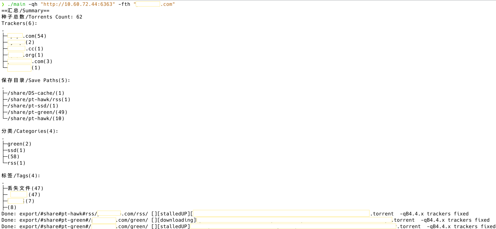
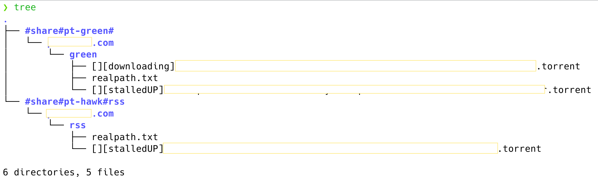

# qbittorrent-torrents-exporter 
本工具需要Web API 功能打开的**运行中的 qbittorrent 客户端**和其配套的 **`BT_backup` 文件夹**。

本工具用于从 BT_backup 中导出 torrent 文件并重命名，并基于 Web API 来支持对 tracker、标签、分类、保存路径等筛选导出。同时针对 qbittorrent 4.4.x 版本会将 tracker 信息从 .torrent 文件中移除一改变，工具支持自动从 .fastresume 文件中读取并还原进导出的 .torrent 文件。

请确保 `BT_backup` 文件夹（内含 .torrent 和 .fastresume 文件）与本工具处在同一目录下 **（如下图示意）** ，导出的种子文件将会在新建的名为 `export` 的文件夹内。


默认 BT_backup 文件夹地址 ([inspired from jslay88/qbt_migrate](https://github.com/jslay88/qbt_migrate)):
 - Windows: `%LOCALAPPDATA%/qBittorrent/BT_backup`
 - Linux/Mac: `$HOME/.local/share/data/qBittorrent/BT_backup`

This tool need a **running qbittorrent program** with its Web API supported and its **`BT_backup` folder**.

It can help you export torrent files from BT_backup and automatically rename them, with tracker/tag/category/path-filter supported. Besides, it can automatically append missing trackers into exported .torrent file as qbittorrent 4.4.x will remove tracker information from .torrent file.

Please make sure the `BT_backup` folder(.torrent and .fastresume files) is under the same folder with exporter, and the exported torrent files will in a new-create folder named `export`.

Default BT_backup paths ([inspired from jslay88/qbt_migrate](https://github.com/jslay88/qbt_migrate)):
 - Windows: `%LOCALAPPDATA%/qBittorrent/BT_backup`
 - Linux/Mac: `$HOME/.local/share/data/qBittorrent/BT_backup`
## 使用方法 | How to use

[Download the bianary (no Go environment needed) in releases page](https://github.com/ludoux/qbittorrent-torrents-exporter/releases)

导出目录 | Exported Path: `export/<path>/<trackerhost>/<category>/`

导出文件名 | Exported Filename: `[<tags>][<state>]<name>.torrent`

### 纯参数运行 | Running with arguments only

| 参数名          | 解释                                                         | 示例                                     |
| --------------- | ------------------------------------------------------------ | ---------------------------------------- |
| `qh`            | *qBittorrent Host Url (Web API)                              | `-qh "http://127.0.0.1:6363"`            |
| `qu`            | 登录用户名 \| qBittorrent Username                           | `-qu "admin"`                            |
| `qp`            | 登录密码 \| qBittorrent Password                             | `-qp "password"`                         |
| `fc`            | 需要导出的分类(留空全导出) \| Categories to be exported(Stay blank to export all) | `-fc "cate1,cate2"` or `-fc ""`          |
| `fp`            | 需要导出的保存路径(留空全导出) \| SavePaths to be exported(Stay blank to export all) | `-fp "path1,path2"` or `-fp ""`          |
| `ft`            | 需要导出的标签(留空全导出) \| Tag to be exported(Stay blank to export all) | `-ft "tag1,tag2"` or `-ft ""`            |
| `fth`           | 需要导出的tracker(留空全导出) \| Tracker to be exported(Stay blank to export all) | `-fth "leech.com,club.net"` or `-fth ""` |
| `at`            | 将导出的任务打上此标签名(留空不打) \| Tag exported torrent task(Stay blank to not tag) | `-at "exported"` or `-at ""`             |
| `disableAnalyze`            | 详见下文 \| More details below | `-disableAnalyze`             |
| `detectBt`            | 详见下文 \| More details below | `-detectBt`             |

```
❯ ./qbittorrent-torrents-exporter -h
Usage of ./qbittorrent-torrents-exporter:
  -at string
        AppendTag (default "-")
  -debug
        Debug
  -detectBt
        if true, we treat torrents with DHT enabled as BT torrents, and report its tracker as _bt_
  -disableAnalyze
        if true, we report all torrent trackers as _tracker_
  -fc string
        CategoryFilter (default "-")
  -fp string
        PathFilter (default "-")
  -ft string
        TagFilter (default "-")
  -fth string
        TrackerHostFilter (default "-")
  -qh string
        qBittorrent host. ex: http://127.0.0.1:6363
  -qp string
        qBittorrent password.
  -qu string
        qBittorrent usrname.
```

PS: 如果不传入 `qh` 参数，则会使用引导交互来在终端输入登录信息等；如果不传入 `fc` `fp` `ft` `fth` `at` 中任一参数，则会使用交互引导来在终端输入筛选信息等。

PS: If  `qh` is unset, tool will ask users to give login information. If `fc` `fp` `ft` `fth` and `at` are all unset, tool will ask users to give filter information.

#### Examples
```
❯ ./qbittorrent-torrents-exporter -qh "http://127.0.0.1:8080"
❯ ./qbittorrent-torrents-exporter -qh "http://127.0.0.1:8080" -qu "admin" -qp "adminadmin"
❯ ./qbittorrent-torrents-exporter -qh "http://127.0.0.1:8080" -qu "admin" -qp "adminadmin" -fc "cate_needed_to_export"
❯ ./qbittorrent-torrents-exporter -qh "http://127.0.0.1:8080" -qu "admin" -qp "adminadmin" -fc "cate_needed_to_export" -at "exported"
```

#### disableAnalyze & detectBt & How the it analyze TrackerHost
本工具最容易出现的问题便是在 tracker 分析上，这里提供两个单独的开关来调整 tracker 分析的工作状态，以减少软件出错的机率。请注意如下的回报只指 TrackerHostFilter 页面，不会影响实际导出种子文件的 tracker 信息。

分析 TrackerHost 的目的是在 TrackerHostFilter 精准提出 `host.domain` 类型的分类。理论上它会排除二级域名，只取域名区域。

- 当 `-disableAnalyze` 启用时，**所有**种子都会回报 `_tracker_`
- 当 `-detectBt` 启用时，**所有 DHT 被禁用**种子都会回报 `_bt_`（请注意，当在qB中关闭 DHT 功能时，可能不能正常识别 BT 种子），其余情况则按下一条（正常情况）分析。
- 正常情况下。如果没有 tracker，回报`_no_tracker_`；如果分析失败，回报`_err_tracker_`；如果多主机名，回报`_multi_trackerhost_`。

The most common bug of this exporter happens during analyzing tracker hosts. Here're two tags to tweak the progress to avoid some bugs. Please note that the following "report" only refers to the TrackerHostFilter page and does not affect the tracker information of the actual exported torrent files.

The purpose of analyzing TrackerHost is to accurately present `host.domain` type classifications in TrackerHostFilter. Theoretically it will exclude secondary domains and take only domain zones.

- When `-disableAnalyze` is enabled, **all** seeds report `_tracker_`
- When `-detectBt` is enabled, **all DHT disabled **seeds report `_bt_` (note that BT torrents may not be recognized properly when the DHT function is disabled in qB), and the rest of the cases are analyzed as in the next (normal) case.
- Normal case. Reports `_no_tracker_` if there is no tracker, `_err_tracker_` if the analysis fails, and `_multi_trackerhost_` for multiple hostnames.


### 交互式运行 | Running directly

不传递任何参数或者只传递 `-githubchannel` 参数，软件则会以交互方式让用户提供相关信息。

Tool will ask users to provide information if all arguments are unset or only `-githubchannel` is set.

## 截图 | Screenshots




